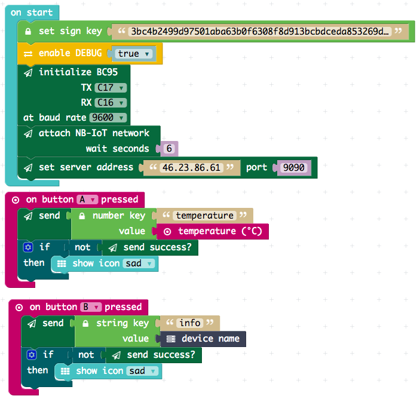

# ubirch NB-IoT message module

This is a package for sending signed data messages to the [ubirch](http://ubirch.com) backend.
It can be used by the [PXT Calliope mini editor](https://pxt.calliope.cc/). Should also work
with PXT for Micro:bit.

## Testing

- Modify `tests.ts` to send packages to your own server.
- Execute a little server: `nc -vv -ul -p 9090` (Linux, also echos the messages) 
- Compile the test `pxt test` and copy `built/binary.hex` to the Calliope mini.

On the USB console window you will see this:

```
TEST START
!!!!  PACKET & SIGNATURE TEST
ID BC9AB239
TEST: set sign key: OK
TEST: create signed packet: OK
!!!!  NETWORK TEST
TEST: sending hello world: OK
TEST: sending number (temp): OK
TEST: sending number (light): OK
TEST: sending string: OK
TEST FINISHED OK
``` 

> It will take some time to send the messages, as the the nRF51 not the fastest chip for
> the Ed25519 signature generation.

## Example

### Blocks


### Javascript

```typescript

```

## Meta

- PXT/calliope
- PXT/microbit

Depends on [pxt-calliope-bc95](https://github.com/calliope-mini/pxt-calliope-bc95).

Author: Matthias L. Jugel ([@thinkberg](https://twitter.com/thinkberg))

## License

MIT